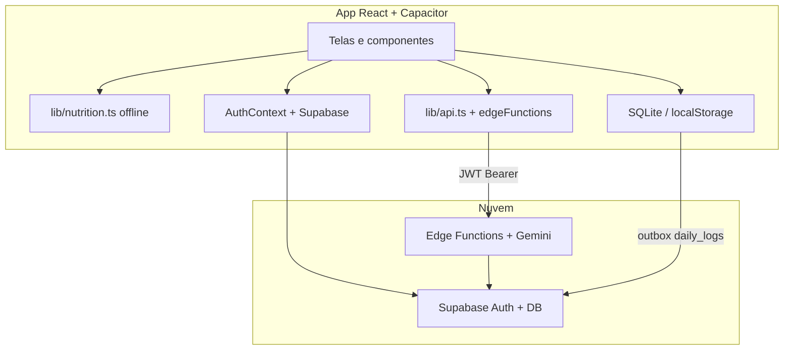

# Arquitetura

> Descreve o estado **v1.2.0**. Versões anteriores: [versions/](./versions/README.md)

## Visão geral



## Stack

| Camada | Tecnologia |
|--------|------------|
| UI | React 19, React Router 7, Tailwind 4 |
| Build | Vite 6, TypeScript 5.8 |
| Mobile | Capacitor 8 |
| Auth | Supabase Auth (e-mail/senha) |
| Estado servidor | TanStack Query (cache global) |
| Gráficos | Recharts |
| Busca alimentos/exercícios | Fuse.js |

## Estrutura `src/`

```
src/
├── main.tsx              # Entry; valida env Supabase
├── appShell.tsx          # Router + Auth + QueryClient
├── App.tsx               # Efeitos Capacitor + rotas
├── routes/AppRoutes.tsx  # Definição de rotas
├── layouts/AppLayout.tsx # Header + bottom nav + outlet
├── pages/                # Telas por rota
├── components/           # UI reutilizável (CalendarStrip, FoodPicker, MacroChart, …)
├── contexts/AuthContext.tsx
├── lib/
│   ├── nutrition.ts      # Cálculo offline
│   ├── api.ts            # Cliente Edge Functions (Gemini)
│   ├── supabase.ts
│   ├── localDb/          # Cache + fila offline
│   └── data/outboxSync.ts
├── data/
│   ├── calorias.json
│   └── exercicios.json
├── theme/                # Design tokens
└── types/
```

## Rotas

| Rota | Auth | Descrição |
|------|------|-----------|
| `/login` | Não | Login e-mail/senha |
| `/cadastro` | Não | Registro |
| `/` | Sim | Redireciona para `/home` ou `/login` |
| `/home` | Sim | Registro do dia + resumo + IA |
| `/dashboard` | Sim | Resumo nutricional com filtro por dia (`CalendarStrip`) |
| `/historico` | Sim | Histórico por mês |
| `/sobre` | Sim | Página institucional |
| `/profile` | Sim | Perfil e logout |
| `/settings` | Sim | Tema e atalhos |
| `/settings/privacy` | Sim | Privacidade e biometria |
| `/settings/personalizacao` | Sim | Densidade de UI |

## Fluxo principal (Home)

1. Usuário seleciona exercícios (`ExercisePicker`) e alimentos (`FoodPicker`)
   - **Exercícios:** busca remota via `exercise-search` (local → cache → WGER + Gemini); fallback offline em `exercicios.json`
   - **Alimentos:** busca remota via `food-search` (local → cache → USDA FDC + Gemini); fallback offline em `calorias.json`
2. **Calcular resumo** → `postNutritionSummary()` (Edge Function `nutrition-summary` + Gemini); fallback offline em `buildSummary()`
3. Exibe kcal gastas/consumidas, balanço e `MacroChart`
4. **Pedir recomendação IA** → Edge Function `ai-recommendations` com JWT
5. Cooldown consultado via `ai-cooldown` (`CooldownBanner`)

## Fluxo do Dashboard (`/dashboard`)

1. **`CalendarStrip`** — faixa scrollável com 7 dias (hoje ±3); dia selecionado em pill escuro; dots vermelhos (`colors.badge`) em dias com `summary` no histórico carregado
2. **Histórico** — `fetchDailyLogHistory(userId, 30)` na montagem; alimenta gráficos semanais, streak e `eventDates`
3. **Dia selecionado** — `fetchDailyLog(userId, logDate)` a cada mudança de data; atualiza anéis (`ProgressRings`), exercícios e balanço
4. **Gráficos semanais** — janela de 7 dias **terminando** no dia selecionado (`buildLast7Days(anchor)`); barra destacada = dia filtrado
5. **Sequência (streak)** — sempre calculada a partir de **hoje**, independente do filtro

Componente reutilizável: `src/components/CalendarStrip.tsx` (origem: ESM_ANDROID). Props: `selectedDate`, `onDateSelect`, `visibleDays?`, `eventDates?`. Sem dependências externas de calendário.

## Cálculo nutricional (cliente)

Portado do protótipo Streamlit:

- Alimentos: macros proporcionais à quantidade em **gramas** (`qty / 100`)
- Água: quantidade em **litros** → convertida para ml (`× 1000`) antes do fator
- Exercícios: `calorias_queimadas_por_minuto × duração` (prioriza `caloriasPorMinuto` do entry quando veio da busca WGER)

Fonte local: `src/data/calorias.json`, `src/data/exercicios.json` · cache remoto: `food_catalog`, `exercise_catalog`

## Offline e sincronização

- **Resumo do dia**: funciona sem rede (cálculo local)
- **Fila outbox** (`localDb` + `outboxSync`): preparada para `daily_logs` (insert/upsert)
- **NetworkBanner**: aviso offline + sincronização manual da fila
- **OfflineSyncEffects**: processa fila ao voltar online ou ao retornar ao app

## Capacitor

| Módulo | Uso |
|--------|-----|
| `NativeShellEffects` | Status bar, splash, teclado |
| `BiometricLock` | Bloqueio ao retornar do background |
| `PushNotificationsEffects` | FCM + registro no Supabase |
| `OfflineSyncEffects` | Sync da fila local |

## Segurança

- Chave Gemini **somente nos secrets das Edge Functions** (`GOOGLE_API_KEY`) — ver [GEMINI_SECRETS.md](./GEMINI_SECRETS.md); nunca `VITE_GEMINI_API_KEY` no cliente
- Modelo padrão: `gemini-3.1-flash-lite` em `_shared/gemini.ts` (override: secret `GEMINI_MODEL`)
- Chaves de APIs externas (`FDC_API_KEY`, `WEGER_API_KEY`) também **somente nos secrets** — nunca `VITE_*` no bundle
- JWT Supabase enviado no header `Authorization` para as Edge Functions
- Credenciais biométricas em secure storage (nativo)
- Auditoria de erros críticos via `security_audit_events` (quando configurado)
