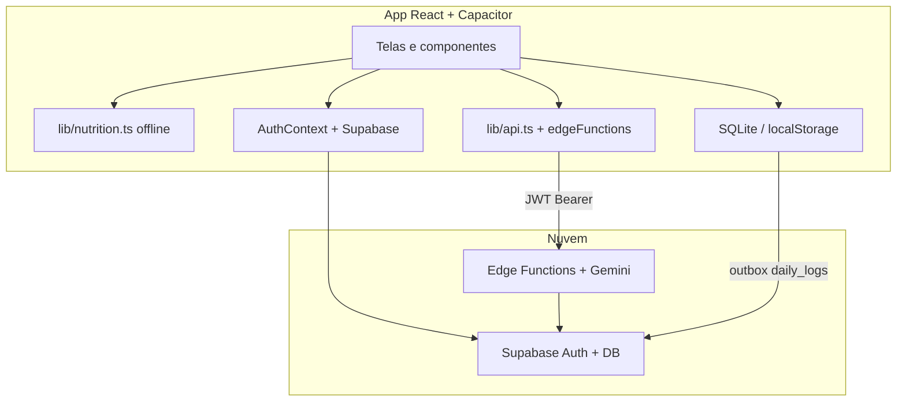

# Arquitetura

> Descreve o estado **v1.2.0+** (inclui refactor UX "Seu dia"). Versões anteriores: [versions/](./versions/README.md) · Detalhes do refactor: [UX_SEU_DIA.md](./UX_SEU_DIA.md)

## Visão geral



## Stack

| Camada | Tecnologia |
|--------|------------|
| UI | React 19, React Router 7, Tailwind 4 |
| Build | Vite 6, TypeScript 5.8 |
| Mobile | Capacitor 8 |
| Auth | Supabase Auth (e-mail/senha) |
| Estado servidor | TanStack Query 5 (`useDailyLog`, `useDailyLogHistory`, `useSaveDailyLog`) |
| Gráficos | Recharts |
| Busca alimentos/exercícios | Fuse.js |

## Estrutura `src/`

```
src/
├── main.tsx              # Entry; valida env Supabase
├── appShell.tsx          # Router + Auth + QueryClient
├── App.tsx               # Efeitos Capacitor + rotas
├── routes/AppRoutes.tsx  # Definição de rotas
├── layouts/AppLayout.tsx # Header + bottom nav + outlet
├── pages/                # Telas por rota
├── hooks/                # useDailyLog, useDailyLogHistory (TanStack Query)
├── components/           # UI reutilizável (CalendarStrip, DaySummaryBar, CoachSection, …)
├── contexts/AuthContext.tsx
├── lib/
│   ├── nutrition.ts      # Cálculo offline
│   ├── api.ts            # Cliente Edge Functions (Gemini)
│   ├── supabase.ts
│   ├── localDb/          # Cache + fila offline
│   └── data/outboxSync.ts
├── data/
│   ├── calorias.json
│   └── exercicios.json
├── theme/                # Design tokens
└── types/
```

## Rotas

| Rota | Auth | Descrição |
|------|------|-----------|
| `/login` | Não | Login e-mail/senha |
| `/cadastro` | Não | Registro |
| `/` | Sim | Redireciona para `/home` ou `/login` |
| `/home` | Sim | **Seu dia** — pickers, auto-save, resumo sticky, coach IA colapsável |
| `/dashboard` | Sim | **Resumo** — anéis, gráficos 7 dias, streak (`CalendarStrip`) |
| `/historico` | Sim | Histórico por mês |
| `/sobre` | Sim | Página institucional |
| `/profile` | Sim | Perfil e logout |
| `/settings` | Sim | Tema e atalhos |
| `/settings/privacy` | Sim | Privacidade e biometria |
| `/settings/personalizacao` | Sim | Densidade de UI |

## Fluxo "Seu dia" (`/home`)

Documentação completa: [UX_SEU_DIA.md](./UX_SEU_DIA.md)

1. **`CalendarStrip`** — seleciona o dia (hoje ±3); dots em dias com registro (`useDailyLogHistory`)
2. **`useDailyLog(userId, logDate)`** — carrega exercícios, alimentos e summary do dia; `<Skeleton>` enquanto carrega
3. Usuário edita **`ExercisePicker`** / **`FoodPicker`**
   - **Exercícios:** busca remota via `exercise-search`; fallback offline em `exercicios.json`
   - **Alimentos:** busca remota via `food-search`; fallback offline em `calorias.json`
4. **Auto-save (debounce 1,5 s)** — `buildSummary()` local + `useSaveDailyLog()`; badge "Salvando…" / "Salvo ✓" / "Pendente sync"
5. **`DaySummaryBar`** (sticky) — Gastas / Consumidas / Balanço visíveis ao rolar; link "Ver →" para `/dashboard`
6. **`MacroChart`** — macronutrientes quando há summary
7. **CTA fixo** — "Calcular com IA" / "Atualizar com IA" → `postNutritionSummary()` (Gemini); fallback offline
8. **`CoachSection`** (colapsável) — recomendação via `ai-recommendations`; cooldown via `ai-cooldown`

## Fluxo "Resumo" (`/dashboard`)

1. **`CalendarStrip`** — faixa scrollável com 7 dias (hoje ±3); dots (`colors.badge`) em dias com `summary`
2. **`useDailyLogHistory(userId, 30)`** — histórico, gráficos semanais, streak, `eventDates`
3. **`useDailyLog(userId, logDate)`** — dados do dia selecionado; anéis (`ProgressRings`), stat cards
4. **Gráficos semanais** — janela de 7 dias terminando no dia selecionado; barra destacada = dia filtrado
5. **Sequência (streak)** — calculada a partir de **hoje**, independente do filtro

## TanStack Query (daily logs)

| Hook | Query key | Função |
|------|-----------|--------|
| `useDailyLog` | `['dailyLog', userId, logDate]` | Busca log de um dia |
| `useDailyLogHistory` | `['dailyLogHistory', userId]` | Histórico (default 30 dias) |
| `useSaveDailyLog` | mutation | Upsert + invalidação das queries acima |

Provider: `src/appShell.tsx` · Hooks: `src/hooks/useDailyLog.ts`, `src/hooks/useDailyLogHistory.ts`

## Componentes compartilhados

| Componente | Arquivo | Uso |
|------------|---------|-----|
| `CalendarStrip` | `components/CalendarStrip.tsx` | Home + Dashboard — props: `selectedDate`, `onDateSelect`, `eventDates?` |
| `DaySummaryBar` | `components/DaySummaryBar.tsx` | Home — resumo sticky kcal |
| `CoachSection` | `components/CoachSection.tsx` | Home — IA colapsável |

Bottom nav: `/dashboard` = **Resumo** (`LayoutDashboard`), `/home` = **Seu dia** (`Home`).

## Cálculo nutricional (cliente)

Portado do protótipo Streamlit:

- Alimentos: macros proporcionais à quantidade em **gramas** (`qty / 100`)
- Água: quantidade em **litros** → convertida para ml (`× 1000`) antes do fator
- Exercícios: `calorias_queimadas_por_minuto × duração` (prioriza `caloriasPorMinuto` do entry quando veio da busca WGER)

Fonte local: `src/data/calorias.json`, `src/data/exercicios.json` · cache remoto: `food_catalog`, `exercise_catalog`

## Offline e sincronização

- **Resumo do dia**: funciona sem rede (cálculo local)
- **Fila outbox** (`localDb` + `outboxSync`): preparada para `daily_logs` (insert/upsert)
- **NetworkBanner**: aviso offline + sincronização manual da fila
- **OfflineSyncEffects**: processa fila ao voltar online ou ao retornar ao app

## Capacitor

| Módulo | Uso |
|--------|-----|
| `NativeShellEffects` | Status bar, splash, teclado |
| `BiometricLock` | Bloqueio ao retornar do background |
| `PushNotificationsEffects` | FCM + registro no Supabase |
| `OfflineSyncEffects` | Sync da fila local |

## Segurança

- Chave Gemini **somente nos secrets das Edge Functions** (`GOOGLE_API_KEY`) — ver [GEMINI_SECRETS.md](./GEMINI_SECRETS.md); nunca `VITE_GEMINI_API_KEY` no cliente
- Modelo padrão: `gemini-3.1-flash-lite` em `_shared/gemini.ts` (override: secret `GEMINI_MODEL`)
- Chaves de APIs externas (`FDC_API_KEY`, `WEGER_API_KEY`) também **somente nos secrets** — nunca `VITE_*` no bundle
- JWT Supabase enviado no header `Authorization` para as Edge Functions
- Credenciais biométricas em secure storage (nativo)
- Auditoria de erros críticos via `security_audit_events` (quando configurado)
