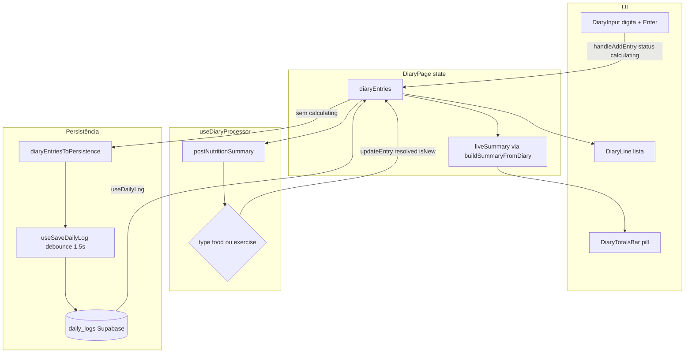

# UX Diário — Página `/diario`

Documentação da tela **Diário** (`/diario`): diário de texto livre no estilo Amy Food Journal. A página `/home` (**Seu dia**) permanece intacta com pickers estruturados.

**Referência visual:** lista plana (sem cards), texto à esquerda, calorias à direita, pill flutuante de totais acima da bottom nav.

---

## Navegação

| Rota | Ícone | Label | Função |
|------|-------|-------|--------|
| `/diario` | `BookOpen` | **Diário** | Registro em linguagem natural + cálculo por linha via IA |

Arquivos: `src/routes/AppRoutes.tsx`, `src/components/BottomNav.tsx`

---

## Arquivos do módulo

| Arquivo | Responsabilidade |
|---------|------------------|
| `src/pages/DiaryPage.tsx` | Página principal: estado, auto-save, totais |
| `src/components/DiaryInput.tsx` | Input inline na lista (última linha) |
| `src/components/DiaryLine.tsx` | Linha do diário: texto + calorias |
| `src/components/DiaryTotalsBar.tsx` | Pill flutuante de totais (kcal, C, P, F) |
| `src/components/SkeletonText.tsx` | Shimmer no texto "Calculando..." |
| `src/hooks/useDiaryProcessor.ts` | Processa cada linha via `nutrition-summary` |
| `src/lib/diary.ts` | Conversão DiaryEntry ↔ persistência + resumo |
| `src/types/nutrition.ts` | `DiaryEntry`, `FoodItemStatus` |

**Reutilizados (sem alteração de contrato):**

- `CalendarStrip` — prop `compact` só nesta página
- `useDailyLog`, `useSaveDailyLog`, `useDailyLogHistory`
- Edge Function `nutrition-summary` via `postNutritionSummary()`

---

## Layout da página

```
┌─────────────────────────────────────┐
│  Diário          🔥 3 dias  Salvo ✓ │  ← header
├─────────────────────────────────────┤
│  [SEG][TER][QUA][QUI][SEX][SAB][DOM]│  ← CalendarStrip compact
├─────────────────────────────────────┤
│  banana                    +105 cal │
│  ─────────────────────────────────  │
│  30 min corrida            -300 cal │
│  ─────────────────────────────────  │
│  O que você comeu...    Calculando..│  ← DiaryInput (inline)
│                                     │
│         (scroll)                    │
│                                     │
│     ┌─────────────────────────┐     │
│     │ 🔥 2245 · 🌾 313 · ...  │     │  ← DiaryTotalsBar (fixed)
│     └─────────────────────────┘     │
│  ┌─────────────────────────────┐    │
│  │  Resumo │ Seu dia │ Diário … │    │  ← BottomNav
│  └─────────────────────────────┘    │
└─────────────────────────────────────┘
```

### Container principal (`DiaryPage`)

| Propriedade | Valor |
|-------------|-------|
| `className` | `pt-4 pb-32 space-y-4` |
| Fundo | Herda `colors.background` do layout pai (`#F5F0EA`) |
| `pb-32` | Espaço para bottom nav + pill de totais |

### Header

- **Título:** `Diário`, `text-2xl font-light`, `colors.textPrimary`
- **Streak:** badge pill `colors.accentSoft` / `colors.accent`, ícone `Flame`
- **Status de save:** `Salvando…` / `Salvo ✓` / `No celular — sincroniza online` com cores por estado

Sem botão Coach IA nesta página (diferente de `/home`).

---

## Componentes

### `DiaryLine`

Uma entrada confirmada do diário.

**Layout:**

```
flex | justify-content: space-between | align-items: center
padding: 13px 0
border-bottom: 1px solid colors.border
```

| Lado | Estilo |
|------|--------|
| Texto (`rawText`) | `fontSize: 15`, `colors.textPrimary`, `flex: 1` |
| Calorias | `fontSize: 14`, `minWidth: 90`, `textAlign: right` |

**Estados de calorias (`CalorieDisplay`):**

| Condição | Exibição | Cor |
|----------|----------|-----|
| `status === 'calculating'` | `<SkeletonText />` | shimmer |
| `type === 'exercise'`, kcal > 0 | `-{kcal} cal` | `colors.points` |
| `type === 'food'`, `isNew`, kcal > 0 | `+{kcal} cal` | `colors.accent` |
| `type === 'food'`, carregado, kcal > 0 | `+{kcal} cal` | `colors.textSecondary` |
| kcal === 0 | `0 cal` | `colors.textMuted` |

Alimentos sempre com prefixo `+`; exercícios sempre com `-`.

---

### `DiaryInput`

Última linha da lista — input inline, sem card.

**Layout:** igual ao `DiaryLine`, mas **sem** `border-bottom` (evita linha extra abaixo do placeholder).

| Elemento | Estilo |
|----------|--------|
| Input | `bg-transparent`, `text-[15px]`, `colors.textPrimary` |
| Placeholder | `O que você comeu ou fez hoje...`, `colors.textMuted` |
| Submit | `Enter` (sem botão de envio) |

**Comportamento:**

- Enquanto o usuário digita (`value.trim().length > 0`), exibe `<SkeletonText />` à direita — feedback imediato de "Calculando..."
- Ao pressionar Enter: chama `onSubmit(text)`, limpa o input, mantém foco

---

### `SkeletonText`

Shimmer no próprio texto (não é barra retangular).

```css
@keyframes shimmer-text {
  0%   { background-position: 200% center; }
  100% { background-position: -200% center; }
}
```

| Propriedade | Valor |
|-------------|-------|
| Texto default | `Calculando...` |
| `fontSize` default | `14` |
| Técnica | `background-clip: text` + `WebkitTextFillColor: transparent` |
| `minWidth` | `90` (evita layout shift) |
| Keyframes ID | `shimmer-text-keyframes` (injetado uma vez no `<head>`) |

> Nota: o gradiente do shimmer usa `#aaa` / `#eee` fixos no componente (efeito visual do texto). Demais cores da UI usam tokens de `src/theme/colors.ts`.

---

### `DiaryTotalsBar`

Pill flutuante com totais do dia. Visível apenas quando `hasTotals` (consumidas, gastas ou proteína > 0).

**Posição:**

```css
position: fixed;
left: 50%;
transform: translateX(-50%);
bottom: calc(11rem + env(safe-area-inset-bottom, 0px));
z-index: 50;
```

**Estilo do pill:**

| Propriedade | Token / valor |
|-------------|---------------|
| `background` | `colors.surface` |
| `border` | `1px solid colors.border` |
| `borderRadius` | `999px` |
| `padding` | `10px 24px` |
| `boxShadow` | `0 2px 16px rgba(0,0,0,0.08)` |

**Conteúdo (ícone + número, separados por `·`):**

| Métrica | Ícone (lucide) | Cor do ícone | Valor |
|---------|----------------|--------------|-------|
| kcal líquido | `Flame` | `colors.accent` | `consumidas - gastas` |
| Carboidratos | `Wheat` | `colors.gradientMid` | `liveSummary.carboidratos` |
| Proteína | `Beef` | `colors.points` | `liveSummary.proteina` |
| Gordura | `Droplets` | `colors.gradientEnd` | `liveSummary.gordura` |

Números: `fontSize: 14`, `fontWeight: 600`, `colors.textPrimary`, `Math.round()`.

---

### `CalendarStrip` (modo `compact`)

Usado só em `DiaryPage` com `compact`.

| | Normal | Compact |
|---|--------|---------|
| Largura do dia | `56px` | `40px` |
| Padding selecionado | `20px 12px` | `8px 6px` |
| Padding normal | `16px 12px` | `6px 6px` |
| Dia da semana | `10px` | `8px` |
| Número do dia | `text-base` | `text-sm` |
| Gap entre dias | `gap-3` | `gap-1.5` |

---

## Tipos

### `FoodItemStatus`

```ts
type FoodItemStatus = 'idle' | 'calculating' | 'resolved'
```

| Status | Quando |
|--------|--------|
| `calculating` | Linha criada, aguardando `nutrition-summary` |
| `resolved` | IA respondeu (sucesso ou falha) |
| `idle` | Carregado do banco (dia anterior) |

### `DiaryEntry`

```ts
interface DiaryEntry {
  id: string
  rawText: string
  type?: 'food' | 'exercise'
  kcal?: number
  carbs?: number
  protein?: number
  fat?: number
  status: FoodItemStatus
  isNew?: boolean      // true após primeiro cálculo IA na sessão
  createdAt: string
}
```

---

## Fluxo de dados



### Sequência ao adicionar uma linha

1. Usuário digita → `SkeletonText` aparece à direita do input
2. Enter → `handleAddEntry` cria `DiaryEntry` com `status: 'calculating'`
3. `useDiaryProcessor` detecta entrada pendente → chama `postNutritionSummary([], [{ name: rawText, quantity: 100 }])`
4. Resposta:
   - `gastas > 0 && consumidas === 0` → `type: 'exercise'`, `kcal = gastas`
   - Caso contrário → `type: 'food'`, `kcal = consumidas`, macros de `proteina/carboidratos/gordura`
5. `updateEntry` → `status: 'resolved'`, `isNew: true`
6. Quando nenhuma linha está `calculating` → `triggerAutoSave` (debounce 1,5 s)
7. `diaryEntriesToPersistence` → `foods[]` + `exercises[]` → upsert no `daily_logs`

### Falha na API

`status: 'resolved'`, `kcal: 0` — linha permanece visível sem travar a UI.

---

## Funções (`src/lib/diary.ts`)

### `buildSummaryFromDiary(entries)`

Agrega apenas entradas com `status !== 'calculating'`.

| Campo `NutritionSummary` | Origem |
|--------------------------|--------|
| `consumidas` | soma `kcal` de `type !== 'exercise'` |
| `gastas` | soma `kcal` de `type === 'exercise'` |
| `proteina`, `carboidratos`, `gordura` | soma dos macros de alimentos |
| `alimentos`, `exercicios` | array de `rawText` |

### `diaryEntriesToPersistence(entries)`

Mapeia para o schema existente do Supabase (sem migration):

| DiaryEntry | Persistido como |
|------------|-----------------|
| `type: 'food'` | `FoodEntry`: `name=rawText`, `localKey=id`, `quantity=100`, `per100g={...}` |
| `type: 'exercise'` | `ExerciseEntry`: `name=rawText`, `localKey=id`, `durationMinutes=1`, `caloriasPorMinuto=kcal` |

### `parseDiaryFromStoredEntries(foods, exercises)`

Reconstrói `DiaryEntry[]` ao carregar o dia. Todas voltam com `status: 'idle'`, `isNew: false`.

---

## Auto-save (`DiaryPage`)

Mesmo padrão de `/home`:

| Parâmetro | Valor |
|-----------|-------|
| Debounce | `1500 ms` |
| Refs | `debounceRef`, `pendingSaveRef` |
| Flush | no `unmount` da página |
| Disparo | após todas as linhas saírem de `calculating` |

**Estados de save:**

| Status | Label | Cor |
|--------|-------|-----|
| `idle` | (oculto) | — |
| `saving` | Salvando… | `textMuted` |
| `saved` | Salvo ✓ | `points` |
| `pending-sync` | No celular — sincroniza online | `accent` |

---

## Sincronização com `/home`

Ambas as páginas gravam no **mesmo** registro `daily_logs` (por `user_id` + `log_date`). Dados adicionados no Diário aparecem em Seu dia (como `FoodEntry`/`ExerciseEntry`) e vice-versa, via `parseDiaryFromStoredEntries` / pickers.

---

## Tokens de cor usados

Todos de `src/theme/colors.ts`:

| Token | Uso na página Diário |
|-------|------------------------|
| `background` | Fundo da tela |
| `surface` | Pill de totais |
| `textPrimary` | Título, texto das linhas, números do pill |
| `textSecondary` | Calorias de alimento (não novo) |
| `textMuted` | Placeholder, separadores `·`, `0 cal` |
| `accent` | Calorias novas (`+kcal`), ícone Flame no pill |
| `accentSoft` | Badge de streak |
| `points` | Calorias de exercício (`-kcal`), ícone Beef |
| `border` | Separadores entre linhas, borda do pill |
| `gradientMid` | Ícone Wheat (carbs) |
| `gradientEnd` | Ícone Droplets (gordura) |

---

## O que esta página NÃO inclui

- `FoodPicker` / `ExercisePicker`
- `CoachSection` / botão cérebro
- `DaySummaryBar` (card Gastas/Consumidas/Restante de `/home`)
- Toggle "Ambos / Só alimentos / Só exercícios"
- Chamada direta a Gemini no cliente (só `nutrition-summary` no servidor)

---

## Checklist de manutenção

- [ ] Ajustar `bottom` do `DiaryTotalsBar` se a altura da `BottomNav` mudar (`src/lib/layout.ts`)
- [ ] Novos estados de linha → atualizar `CalorieDisplay` e `buildSummaryFromDiary`
- [ ] Mudança no schema `daily_logs` → revisar `diaryEntriesToPersistence` / `parseDiaryFromStoredEntries`
- [ ] Shimmer duplicado → `SkeletonText` usa ID `shimmer-text-keyframes`; `SkeletonBox` usa `skeleton-box-keyframes` (sem conflito)
