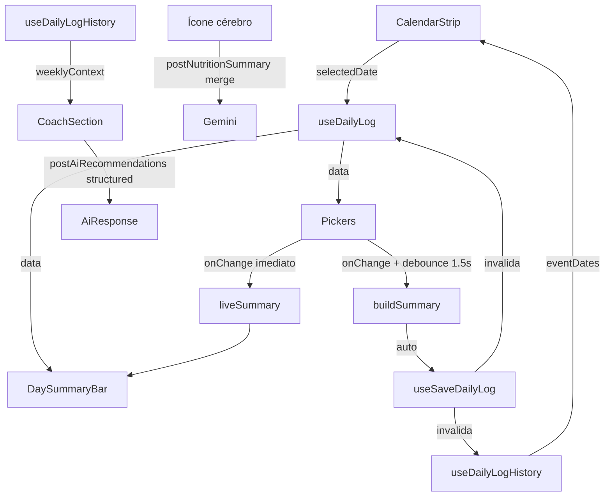

# UX "Seu dia" — Refactor `/home`

Documentação do refactor da tela **Seu dia** (`/home`) e das melhorias transversais em **Resumo** (`/dashboard`).

**Arquivos principais:** `src/pages/NutritionHomePage.tsx`, `src/pages/DashboardPage.tsx`, `src/hooks/useDailyLog.ts`, `src/hooks/useDailyLogHistory.ts`

---

## Problemas resolvidos

| Antes | Depois |
|-------|--------|
| Cálculo manual — usuário precisava clicar em "Calcular resumo" | Auto-save com debounce (1,5 s) recalcula e persiste ao alterar pickers |
| Alterações nos pickers não persistiam até calcular | `saveDailyLog` dispara automaticamente após debounce |
| Só o dia de hoje — sem navegação por data | `CalendarStrip` igual ao Dashboard; edição de dias anteriores |
| Página longa — IA enterrada no final | `CoachSection` colapsável; resumo sticky no topo |
| Feedback fraco (`dayLoading` = texto pequeno) | `<Skeleton>` nos pickers enquanto carrega |
| Duas visualizações sem ligação clara | `DaySummaryBar` com link "Ver →" para `/dashboard` |
| `useEffect` manual em Home e Dashboard | TanStack Query (`useDailyLog`, `useDailyLogHistory`, `useSaveDailyLog`) |
| Nav confusa ("Início" vs ícone Home) | Aba `/dashboard` renomeada para **"Resumo"** |

---

## Navegação (bottom nav)

| Rota | Ícone | Label | Função |
|------|-------|-------|--------|
| `/dashboard` | `LayoutDashboard` | **Resumo** | Visão analítica: anéis, gráficos 7 dias, streak |
| `/home` | `Home` | **Seu dia** | Registro e edição: pickers, auto-save, coach IA |
| `/historico` | `Calendar` | Histórico | Histórico mensal |
| `/sobre` | `Info` | Sobre | Institucional |

Arquivo: `src/components/BottomNav.tsx`

---

## Fluxo de dados

---

## TanStack Query

Provider global em `src/appShell.tsx` (`staleTime: 5 min`, `gcTime: 24 h`, `retry: 2`).

### `useDailyLog(userId, logDate)`

- **Query key:** `['dailyLog', userId, logDate]`
- **Retorno:** `{ exercises, foods, summary } | null` (via `parseDailyLogRow`)
- **Usado em:** `NutritionHomePage`, `DashboardPage`

### `useDailyLogHistory(userId, limit?)`

- **Query key:** `['dailyLogHistory', userId]`
- **Retorno:** array de rows `daily_logs` (default: últimos 30 dias)
- **Usado em:** `CalendarStrip` (`eventDates`), gráficos semanais, streak

### `useSaveDailyLog()`

- **Mutation:** upsert em `daily_logs` via `saveDailyLog()`
- Se `summary` omitido, calcula com `buildSummary()` (local, sem IA)
- **Invalidação:** `dailyLog` do dia + `dailyLogHistory` do usuário
- **Retorno:** `{ synced: boolean, summary }` — `synced: false` enfileira no outbox offline

Arquivos: `src/hooks/useDailyLog.ts`, `src/hooks/useDailyLogHistory.ts`

---

## Tela "Seu dia" (`/home`)

### Layout (de cima para baixo)

1. **Header** — título "Seu dia" + streak + status de save + **ícone cérebro** (Refinar com IA)
2. **`CalendarStrip`** — 7 dias (hoje ±3); dots em dias com registro
3. **`DaySummaryBar`** (sticky) — Gastas / Consumidas / Balanço + link "Ver →" `/dashboard`; alimentado por **`liveSummary`** (tempo real)
4. **Pickers** — `ExercisePicker` + `FoodPicker` (ou `<Skeleton>` durante load); dropdown fecha ao clicar fora ou rolar
5. **`MacroChart`** — macronutrientes (quando há `liveSummary`)
6. **`CoachSection`** — resposta semanal estruturada; countdown no header quando em cooldown
7. **`AiRefineResultCard`** (modal) — confirmação glass após refino com IA

### Auto-save

- **Gatilho:** qualquer mudança em exercícios ou alimentos
- **Debounce:** 1,5 s
- **Cálculo:** `buildSummary()` local (sem chamar Gemini)
- **Persistência:** `useSaveDailyLog().mutate(...)`
- **Flush ao sair:** se o usuário navega antes do debounce, o save pendente executa no unmount (`pendingSaveRef`)

### Resumo em tempo real (`liveSummary`)

- Calculado com `useMemo` a partir de `exercises` + `foods` via `buildSummary()`
- Alimenta `DaySummaryBar` e `MacroChart` **sem esperar** o debounce de auto-save
- O `summary` persistido no banco continua sendo atualizado pelo auto-save ou pelo ícone **Refinar com IA**

### Indicador de status

| Estado | Texto | Cor (`colors.*`) |
|--------|-------|------------------|
| `saving` | Salvando… | `textMuted` |
| `saved` | Salvo ✓ | `points` |
| `pending-sync` | No celular — sincroniza online | `accent` |
| `idle` | (oculto) | — |

O badge some automaticamente 3 s após `saved` ou `pending-sync`.

### Refinar com IA (ícone cérebro)

- Ícone `Brain` no header, à direita de **Seu dia** (sem botão fixo na bottom nav)
- Chama `postNutritionSummary()` com entradas completas; merge local via `mergeNutritionSummary()` (anti-zeragem)
- Sucesso → modal [`AiRefineResultCard`](src/components/AiRefineResultCard.tsx) (glass) com diff e **Confirmar**
- Fallback offline: `buildSummary()` local

> Detalhes: [UX_MELHORIAS_USUARIO.md](./UX_MELHORIAS_USUARIO.md#quarta-onda--coach-semanal-e-ia-refinada)

---

## Componentes novos

### `DaySummaryBar`

Arquivo: `src/components/DaySummaryBar.tsx`

| Prop | Tipo | Descrição |
|------|------|-----------|
| `summary` | `NutritionSummary` | Dados do dia |
| `showDashboardLink?` | `boolean` | Exibe link "Ver →" para `/dashboard` |

- `position: sticky; top: 0` — visível enquanto rola
- Cores: gastas (`points`), consumidas (`accent`), balanço (`points` ou `accent`)

### `CoachSection`

Arquivo: `src/components/CoachSection.tsx`

| Prop | Tipo | Descrição |
|------|------|-----------|
| `hasSummary` | `boolean` | Permite pedir recomendação |
| `onRequest` | `(goals: string) => Promise<void>` | Callback ao pedir recomendação |
| `isLoading` | `boolean` | Estado de loading da IA |
| `cooldownSeconds` | `number` | Segundos restantes de cooldown |
| `structured` | `CoachRecommendationStructured \| null` | Resposta em blocos (semanal) |
| `response` | `string \| null` | Fallback texto plano |
| `error` | `string \| null` | Mensagem de erro |

- Começa **fechado** (colapsável)
- Integra `CooldownBanner` quando em cooldown (seção aberta)
- Countdown no **header** quando fechado e em cooldown
- Envia contexto semanal via `buildWeeklyCoachContext()` em [`coachContext.ts`](src/lib/coachContext.ts)

### `AiRefineResultCard`

Arquivo: `src/components/AiRefineResultCard.tsx`

- Overlay glass após refino com IA
- Props: `before`, `after` (`NutritionSummary`), `onConfirm`
- Usa `getSummaryAdjustments()` para listar métricas alteradas

---

## Tela "Resumo" (`/dashboard`)

Migrada para TanStack Query — sem `useEffect` manual.

- `useDailyLogHistory(userId, 30)` — histórico, streak, `eventDates`, gráficos semanais
- `useDailyLog(userId, selectedKey)` — dados do dia selecionado
- Opacidade reduzida nos anéis enquanto `isFetching`
- Acessibilidade: `aria-label` nos anéis SVG, barras de progresso e `StatCard`

---

## Tokens de layout

Definidos em `src/lib/layout.ts`:

| Constante | Uso |
|-----------|-----|
| `CTA_BOTTOM_CLASS` | Posição do botão fixo acima da bottom nav |
| `SECTION_WITH_CTA_PADDING_CLASS` | Padding inferior do conteúdo para não sobrepor o CTA |
| `MAIN_BOTTOM_PADDING_CLASS` | Padding do `<main>` para a bottom nav |
| `NAV_BOTTOM_CLASS` | Posição da bottom nav |

---

## Testar manualmente

1. **Auto-save:** adicionar alimento → aguardar 1,5 s → badge "Salvo ✓"; recarregar página → item persiste
2. **Resumo instantâneo:** adicionar alimento → `DaySummaryBar` mostra kcal antes do debounce
3. **Flush save:** adicionar item → ir para Resumo antes de 1,5 s → voltar → item persistiu
4. **Offline:** desligar rede → alterar picker → badge "Pendente sync"; voltar online → sync via outbox
5. **CalendarStrip:** selecionar dia anterior com dot → pickers carregam dados daquele dia
6. **Dropdown:** abrir busca → clicar fora ou rolar → dropdown fecha
7. **Toggle + foco:** "Só alimentos" → campo de busca recebe foco automaticamente
8. **Resumo sticky:** rolar a página → barra Gastas/Consumidas/Balanço permanece visível
9. **Coach IA:** resposta estruturada (Alimentos, Água, Exercícios, Próximo passo) com contexto semanal
10. **Refinar IA:** ícone cérebro → card glass → Confirmar; calorias não zeram
11. **Navegação cruzada:** link "Ver →" na barra sticky leva a `/dashboard?date=YYYY-MM-DD`
12. **Resumo:** trocar dia no strip → anéis e gráficos atualizam

---

## Referências

- [ARCHITECTURE.md](./ARCHITECTURE.md) — visão geral da stack e rotas
- [UX_MELHORIAS_USUARIO.md](./UX_MELHORIAS_USUARIO.md) — metas, recentes, undo, **Coach semanal**, refino IA
- [DESIGN_SYSTEM.md](./DESIGN_SYSTEM.md) — tokens de cor
- [API.md](./API.md) — Edge Functions `nutrition-summary`, `ai-recommendations`
