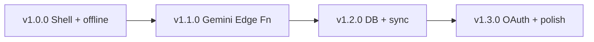

# Histórico de versões — NTRSL AI

Documentação do produto organizada **por release**. Cada arquivo descreve o que foi entregue, como configurar e o que ainda não está incluído naquela versão.

| Versão | Status | Foco |
|--------|--------|------|
| [v1.0.0](./v1.0.0.md) | Entregue | Shell do app, cálculo offline, auth UI |
| [v1.1.0](./v1.1.0.md) | Entregue | IA via Gemini (Edge Functions Supabase) |
| [v1.2.0](./v1.2.0.md) | **Atual** | Banco Supabase, persistência, histórico, deploy |
| [v1.3.0](./v1.3.0.md) | Planejado | OAuth, tema escuro, push FCM end-to-end |

## Versão do pacote npm

O `package.json` pode estar atrás do escopo documentado. A referência funcional do repositório é **v1.2.0** (ver [v1.2.0](./v1.2.0.md)).

## Documentação técnica transversal

Estes guias são válidos para a versão atual e evoluem com o projeto:

| Documento | Conteúdo |
|-----------|----------|
| [SETUP.md](../SETUP.md) | Ambiente, `.env.local`, Android |
| [ARCHITECTURE.md](../ARCHITECTURE.md) | Rotas, fluxos, offline |
| [API.md](../API.md) | Edge Functions + Gemini |
| [SUPABASE.md](../SUPABASE.md) | Schema, auth, RLS, storage |
| [DESIGN_SYSTEM.md](../DESIGN_SYSTEM.md) | Tokens de cor e UI |
| [GEMINI_SECRETS.md](../GEMINI_SECRETS.md) | Chave Gemini (`GOOGLE_API_KEY`), modelo `gemini-3.1-flash-lite` — só no Supabase |

## Linha do tempo

## Como usar esta pasta

- **Onboarding:** leia [v1.2.0](./v1.2.0.md) para o estado atual; volte em [v1.0.0](./v1.0.0.md) só se precisar entender decisões iniciais.
- **Deploy:** cada versão lista pré-requisitos e comandos da época.
- **Changelog resumido:** veja também [`CHANGELOG.md`](../../CHANGELOG.md) na raiz do repositório.
