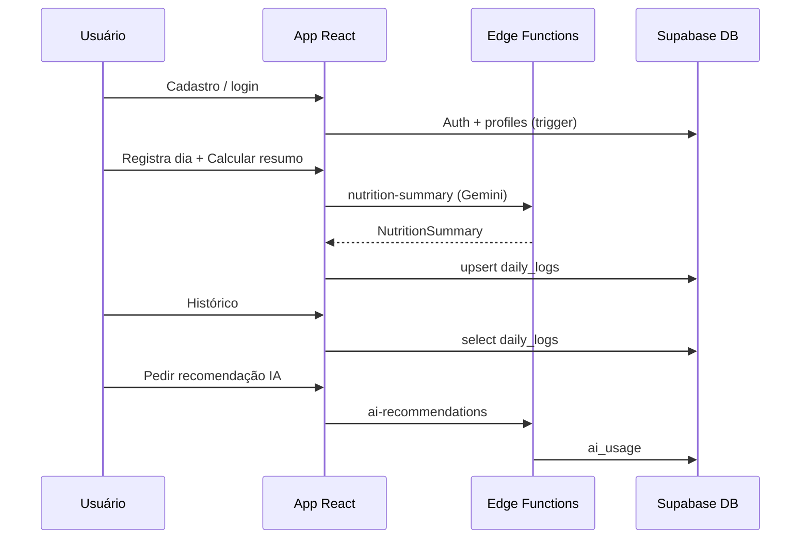

# v1.2.0 — Banco Supabase, persistência e histórico

**Status:** atual (referência do repositório)  
**Projeto Supabase:** `aumvxnccdhcrftvnliwa`

## Resumo

Backend de dados completo no Supabase: tabelas, RLS, trigger de perfil no cadastro, storage de avatares, sincronização de `daily_logs`, histórico na UI e deploy de todas as Edge Functions.

## O que entrou

### Banco de dados

Migrations em `supabase/migrations/`:

| Arquivo | Conteúdo |
|---------|----------|
| `20260611120000_ntrsl_initial_schema.sql` | Tabelas, RLS, triggers, bucket `avatars` |
| `20260611120100_ntrsl_security_hardening.sql` | Revoke RPC em `handle_new_user`, `search_path`, backfill `profiles` |

**Tabelas:** `profiles`, `daily_logs`, `ai_usage`, `push_tokens`, `security_audit_events`

**Auth:**

- Trigger `on_auth_user_created` → insere em `profiles` ao cadastrar
- RLS: cada usuário acessa apenas suas linhas

**Storage:**

- Bucket `avatars` (público leitura; escrita só na pasta `{user_id}/`)

### App — persistência

- `src/lib/data/dailyLogs.ts`
  - `fetchDailyLog()` — carrega o dia
  - `saveDailyLog()` — upsert online ou fila offline
  - `fetchDailyLogHistory()` — lista para histórico
- **Home:** carrega registro de hoje ao abrir; salva após calcular resumo
- **Histórico:** lista dias com detalhes expansíveis e `MacroChart`
- `outboxSync.ts` — upsert com `onConflict: 'user_id,log_date'`

### App — perfil

- `AuthContext` lê tabela `profiles`; cria linha se faltar
- `ProfileScreen` atualiza `profiles.avatar_url` no upload

### Tipos

- `src/types/supabase.ts` regenerado do projeto remoto

### Edge Functions (deployadas)

| Função | Status |
|--------|--------|
| `nutrition-summary` | ACTIVE |
| `ai-recommendations` | ACTIVE |
| `ai-cooldown` | ACTIVE |
| `push-register` | ACTIVE |

## Configuração completa

### 1. `.env.local`

```env
VITE_SUPABASE_URL=https://<project>.supabase.co
VITE_SUPABASE_ANON_KEY=<anon-key>
```

### 2. Secret Gemini (obrigatório para IA)

Configure `GOOGLE_API_KEY` nos secrets do Supabase — **não** no `.env.local`.

→ Passo a passo: **[GEMINI_SECRETS.md](../GEMINI_SECRETS.md)**

### 3. Rodar o app

```bash
npm install
npm run dev
```

### 4. Android (opcional)

```bash
npx cap add android    # primeira vez
npm run cap:sync
npm run cap:open
```

## Fluxo do usuário (v1.2.0)



## Teste manual

1. Criar conta em `/cadastro`
2. Na Home: exercícios + alimentos → **Calcular resumo**
3. Abrir **Histórico** — deve listar o dia
4. Recarregar a Home — dados do dia devem voltar
5. **Pedir recomendação da IA** (requer `GOOGLE_API_KEY` configurada)

## Limitações conhecidas

| Item | Situação |
|------|----------|
| Google OAuth | Planejado v1.3.0 |
| Esqueci minha senha | Não implementado |
| Tema escuro | Toggle sem paleta escura |
| Densidade UI | Salva em localStorage, poucas telas aplicam |
| Push FCM | `push-register` deployada; FCM no Android a configurar |
| Testes automatizados | Ausentes |
| Pasta `android/` | Gerada localmente com `cap add` |

## Arquivos-chave

```
supabase/
├── migrations/
├── functions/
└── config.toml

src/
├── lib/data/dailyLogs.ts
├── pages/NutritionHomePage.tsx
├── pages/HistoricoPage.tsx
└── contexts/AuthContext.tsx
```

## Documentação relacionada

- [API.md](../API.md) — contratos das Edge Functions
- [SUPABASE.md](../SUPABASE.md) — schema e políticas
- [SETUP.md](../SETUP.md) — ambiente de desenvolvimento

## Próxima versão

→ [v1.3.0](./v1.3.0.md) — OAuth, polish de UI, push nativo, qualidade.
